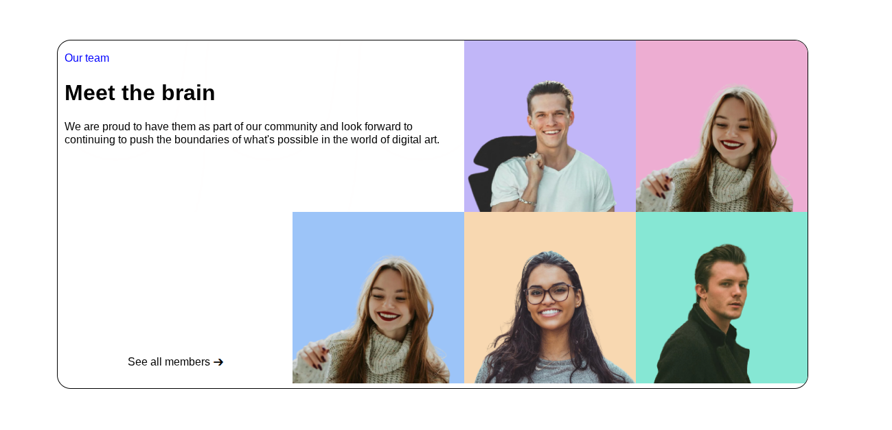

<h2 style="text-align: left;">Team Members Page</h2>
A responsive team member showcase page built with HTML and CSS.

 
<h2 style="text-align: left;">Features</h2>

<ul style="text-align: left;"><li>Fully responsive design for all devices</li><li>Modern grid layout with colorful boxes</li><li>Mobile-first approach with single column layout</li><li>Optimized images for team member photos</li><li>Cross-browser compatible</li></ul>

<h2 style="text-align: left;">Technologies Used</h2>

<ul style="text-align: left;"><li>HTML5</li><li>CSS3</li><li>Flexbox</li><li>Media Queries</li></ul>

<h2 style="text-align: left;">Project Structure</h2>
team-members-page/

├── index.html

├── style.css&nbsp;&nbsp;

└── README.md
<h2 style="text-align: left;">Responsive Design</h2>

<ul style="text-align: left;"><li>Desktop: Multi-column grid layout</li><li>Mobile: Single column stack layout</li><li>Breakpoint: 768px</li></ul>

<h2 style="text-align: left;">Mobile Features</h2>

<ul style="text-align: left;"><li>Single column layout</li><li>"See all members" button at bottom</li><li>Touch-friendly design</li><li>Optimized typography</li></ul>

<h2 style="text-align: left;">⭐ Star this repo if you found it helpful!</h2>
 

&nbsp;

